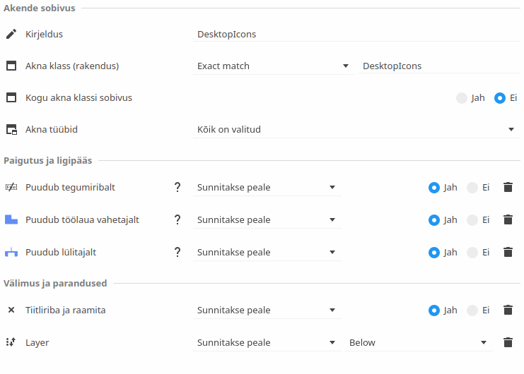

# Markuse asjad next

## Süsteemnõuded

* Markuse asjad nõuetele vastav süsteem kehtiva Verifile 2.0 räsiga. Räsi genereerimiseks peate kasutama [juurutamise tööriista](https://github.com/MarkusMaal/mas-juurariist).
* dotnet-sdk-8.0 või muu ühilduv lahendus kompileerimiseks
* Microsoft Powershell devToolide kasutamiseks
* Avalonia UI pluginad vastava IDE jaoks (Microsoft Visual Studio või JetBrains Rider)
* Operatsioonsüsteem: Windows, macOS või Linux (muid süsteeme ei toetata)
* Minimaalne vajalik salvestusruum:
  * Mitmele platvormile kompileerimine: 25GB (puhastamata), 7GB (puhastatud), 3GB (tihendatud binraarid)
  * Ühele platvormile kompileerimine: 5GB (puhastamata), ~1.5GB (puhastatud), ~500MB (tihendatud binraarid)
  * mas kaust (sh mas-corefiles + mas_maia + Markuse-asjad-next): ~2GB
  * Kompileerimata lähtekood: ~280MB tihendatud, ~600MB lahti pakitud


## PowerShell paigaldamine

Kui dotnet-sdk olemas, saab käivitada käsureal: `dotnet tool install --global PowerShell`

Vastasel korral, saate lugeda [Microsofti saidilt](https://learn.microsoft.com/en-us/powershell/scripting/install/installing-powershell?view=powershell-7.5), kuidas seda teha.


## Kompileerimine ja binraaride uuendamine

Kõik rakendused on järjest võimalik kompileerida, kasutades devTool menüüd. Et avada devTool menüü, sisesta käsureal: `pwsh _devTool_Menu.ps1` või kui olete juba PowerShellis, siis `.\_devTool_Menu.ps1`.

Seejärel peaks avama järgmine menüü:

```
          🔴
        🟡  🟢   markuse arvuti asjad
          🔵

1. Kill processes
2. Restart processes
3. Show projects
4. Update binaries
5. Build solution
6. Clean solution
7. Settings
8. Exit

DevTool v1.3

Ends all Markuse asjad processes, which may be in conflict with new binaries
```

Saate menüüs navigeerida numbrite või nooleklahvidega ning valiku kinnitada vajutades sisestusklahvi (ENTER).

Kompileerimiseks valige `5. Build solution`. See kompileerib kõik rakendused teie opsüsteemile ja riistvarale sobivateks binraarideks out/ kausta.

Et näha millised rakendused on edukalt kompileeritud, kasutage menüüvalikut `3. Show projects`. Iga edukalt kompileeritud rakenduse taga peaks olema kiri `[Build OK]`.

Binraaride uuendamiseks valige menüüst `4. Update binaries`. See sulgeb kõik avatud rakendused automaatselt ning avab need pärast uute binraaride kopeerimist ka uuesti.


## Puhastamine

Puhastamiseks valige `6. Clean solution`. See kustutab ajutised failid, mis olid kasutusel kompileerimise käigus. Samuti saate ka soovi korral kustutada ehitatud binraarid `out/` kaustas, juhul kui te need juba kuhugi mujale liigutasite või soovite otsast alustada.


## Mitme platvormi jaoks kompileerimine

Selleks, et kompileerida iga toetatud platvormi jaoks, valige menüüst `7. Settings`, mis avab omakorda veel ühe menüü:

```

          🔴
        🟡  🟢   markuse arvuti asjad
          🔵

1. Change colors: 2 
2. Verbose mode: False 
3. Show logo: True 
4. Show version: True 
5. Show hints: True 
6. Cross-build: False 
7. Reset settings 
8. Go back 

DevTool v1.3

Changes color scheme in this script 
```

Olge kindlad, et `6. Cross-build` väärtus oleks `True`. Seejärel valige `8. Go back`, et minna tagasi eelmisesse menüüse ning valige sealt `5. Build solution`.

NB: Mitme platvormi jaoks kompileerimine võtab oluliselt kauem aega ja nõuab rohkem salvestusruumi!


## macOS .app konteinerite loomine

1. Kustutage enne alustamist out/ kataloogi sisu (`rm -rf out/`)
2. Ehitage lahendus _devTool_PublishProjects.ps1 skriptiga (`pwsh _devTool_PublishProjects.ps1`)
3. Käivita _devTool_KillAll.ps1 skript, et peatada jooksvad Markuse asjade rakendused (`pwsh _devTool_KillAll.ps1`)
4. Genereerige .app konteinerid käivitades `bash ./_devTool_CreateMacBundles.sh` (NB: see skript üritab ka kopeerida binraarid automaatselt "/home/$USER/.mas/Markuse asjad" kataloogi)
5. Ärge kasutage _devTool_UpdateAll.ps1 skripti või _devTool_Menu.ps1-s "Update binaries" valikut macOSis!!!
6. Kui avate nüüd `out/` kataloogi Finderiga, näete seal genereeritud konteinereid, mida saate avada või liigutada Applications kausta (soovitame luua aliase, päriselt liigutamise asemel, sest siis on rakendusemenüüs alati ajakohane versioon)
7. Kuna need binraarid ei ole märgistatud Apple poolt, siis peate iga rakenduse esimesel käivitamisel tegema järgnevat:
   1. Lockdown peab sätetes olema välja lülitatud
   2. Tuleb valida "Open anyway" sätete rakenduses "Privacy and Security" alt
   3. Mõnikord peate ligipääsu andma ka teatud kaustadele, et rakendus toimiks õigesti
   4. **MarkuStation2** ja **Pidu!** ei toimi macOS-is Apple Silicon seadmetes, kuna LibVLC ei toeta veel seda platvormi, selle asemel peate kasutama [Asahi Linuxit](https://asahilinux.org/). Võite ruumi säästmiseks need konteinerid macOSis kustutada.
8. Käivita _devTool_Restart.ps1 skript, et Markuse arvuti asjade tarkvara taaskäivitada (`pwsh _devTool_Restart.ps1`)

## Aknareeglid Linuxi jaoks

Kui kasutate DesktopIcons rakendust Linuxis, siis võite märgata, et need ikoonid ei püsi akende taga. Selleks, et seda parandada, peate konfigureerima enda aknahalduri vastavate reeglitega.

* Rakenduse klass: DesktopIcons
* Akna päised: TopIcon, Töölauaikoonid

KWini reegleid saab muuta, kui avada `plasma-open-settings` rakendus ja sealt leida "Aknareeglid". Siin on soovitatavad aknareeglid:



Kui pärast nende sätete muutmist nüüd DesktopIcons uuesti käivitada, peaksid ikoonid püsima kõigi teiste akende taga ning samuti kaduma Alt+Tab menüüst ja tegumiribalt.
